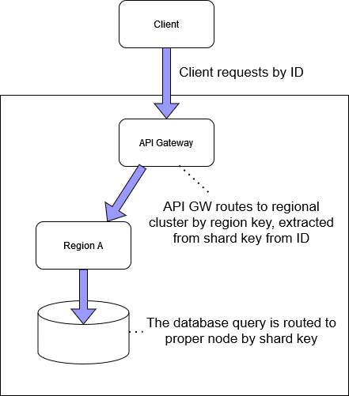

HotGuid
=======

[](https://github.com/dmlarionov/HotGuid/actions/workflows/ci.yml)

Generates time-ordered ID in Guid (UUID) format, which includes 4-byte shard key. 

The feature of an ID generated by the this piece of software is that the shard key can be extracted out of an ID anywhere in the distributed system. This is helpful if you use ID alone to request an entity from a backend, but expect the backend to know which shard to look for the requested entity.

Why time-order is important?
----------------------------
When you massively generate transactional entities (like orders, offers, missions) and insert them to a database the order is important to avoid page splits in ordered storage structures (indexes and tables). The ordered key at least divides in half the cost of an insert versus random key.

If your database is larger than a server memory size the ordered keys saves a lot, because caching is only effective if the hot points in a storage are stable.

Check the articles:

- https://www.2ndquadrant.com/en/blog/sequential-uuid-generators/
- https://www.percona.com/blog/2019/11/22/uuids-are-popular-but-bad-for-performance-lets-discuss/

How to use a shard key?
---------------------
Primary case is the sharding / partitioning in a database. You can use the shard key extracted from ID to query the logical partition / chunk of data by using key in query parameter.

Another case is the request routing at the API gateway level. For instance, having a GraphQL API with `node(id: ID!)` field or REST API with `{id}` path parameter, in the backend you can take a region key out from ID and route request to the proper regional cluster.

### Two level sharding example

A combination of cases (request routing + database sharding) can be implemented by combining region key and shard key into single shard key value inside ID.

For instance, [UN M.49 region codes](https://unstats.un.org/unsd/methodology/m49/), which might be a reasonable choice for request routing, are 10 bit long. Having a 4-byte shard key, you can use another 22 bits or the whole 32-bit value as a shard / partition key at the database level. The remaining 22 bits support quite high key cardinality.



## How to use the generator?

Generate a `Guid` for a given shard key:

```csharp
Guid id = HotGuidGenerator.Instance.NewGuid(shardKey);
```

It's your responsibility to use the shard key, which is meaningful and effective for your sharding scheme.

Take shard key out of such `Guid`:

```csharp
uint shardKey = id.ExtractShardKey();
```

Don't extract shard key out from `Guid` not generated by `HotGuidGenerator`, you'll get meaningless value.

## How ID is built?

The 16 bytes value in Hot Guid consists of:

- a 4-byte *timestamp value* measured in seconds since the Unix epoch. Unsigned integer.
- a 5-byte *random value* generated once per process. This value is unique to the machine and process.
- a 3-byte *incrementing counter*, initialized to a random value.
- a 4-byte *shard key*, passed as an argument to `HotGuidGenerator.Instance.NewGuid(uint shardKey)`.

Take a note, in the first 3 parts Hot Guid reproduces [MongoDB Object Id](https://docs.mongodb.com/manual/reference/method/ObjectId/), which is 12-bytes.

## How probable collisions are?

Like with [MongoDB Object Id](https://docs.mongodb.com/manual/reference/method/ObjectId/) you will not get the same ID generating less than 16,777,216 (2^24) ID values per second (because the counter is 3-byte long) by a single generator instance.

Take a note, that using several generators in your distributed system (usually you have an instance of the generator per service instance) is quite safe, because Mongo algorithm uses 5-byte random value to reduce probability of collisions between generators.

To have 1% probability of getting collision between generators working each at full capacity you need 23,786,20 generator instances according to the formula:


Check https://en.wikipedia.org/wiki/Birthday_problem, see generalized formula at https://stackoverflow.com/questions/184869/are-guid-collisions-possible.

## What timestamp issues might happen?

### January 19, 2038?

Nothing happen because we use unsigned 4-byte timestamp value (`uint`), which is capable to increase up to 4,294,967,295 (2106-02-07 06:28:15 UTC). Covered with tests.

### February 7, 2106?

Due to 32-bit overflow the unix timestamp will start from 0.

Due to reusing the same range collision probability for IDs increased since the current timestamp reaches the first seen timestamp (after the year 2158 if you start using Hot Guid in 2022).

But you are still protected from collisions by 5-byte random value and 3-byte incrementing counter which makes it low if you still generate several orders under 16,777,216 (2^24) ID values per second.

Gratitude
---------

Portion of my code is borrowed from SequentialGuid project (https://github.com/buvinghausen/SequentialGuid/blob/master/README.md). I appreciate Brian Buvinghausen work.